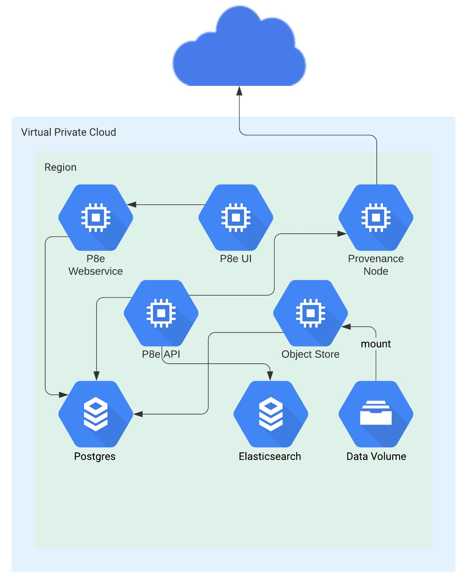

# Architecture

## Diagrams

#### Single node object store environment

The single object store environment works in cases where you are only executing single party contracts or multi-party contracts where all parties exist within your p8e environment. The only service that needs to be exposed outside of your private network is the Provenance node. The minimum Provenance node egress is tcp:26656 in order to reach public Provenance peers.

Default port mappings \(NOTE: these are all configurable and can be changed\):

* P8e Webservice
  * ingress - http:8090
* P8e API
  * ingress - tcp:8080
* Object Store
  * ingress - tcp:80
* Provenance Node
  * internet egress - tcp:26656
  * ingress - tcp:26656-26657, tcp:9090, tcp:1317

#### Multi-node object store environment

Placeholder - insert multi-node object store diagram

## Logical Description

#### P8e Api

This api provides the logic behind contract execution, signing, and distribution to other parties in the case of multi-party contracts. After a contract is fully executed and signed, it is persisted to the Provenance blockchain. This service is secure and can be publicly addressable, but it is recommended to not expose it outside of your private network. If exposed externally, it should be fronted by a load balancer or proxy capable of terminating SSL.

#### Object Store

Object store can run in a few different configurations based on the needs of your p8e environment.

* No external multi-parties - If your p8e environment will strictly be handling single party contracts, or multi-party contracts where all parties are within your p8e environment, a single, privately addressable object store node may be used. The object store locator is not needed in this configuration.
* External multi-parties \(**TBD: This is still actively being open sourced**\) - If your p8e environment needs to execute multi-party contracts with some parties that exist outside of your p8e environment, the following are required:
  * A private object store for your own p8e environment
  * A publicly facing object store that is configured in replication only mode
  * An object store locator service

#### Provenance Node

A provenance node provides your P8e environment with a means to read events and send transactions to the distributed Provenance network. See [here](../../blockchain/running-a-node/running-a-node-1/) for setup.

#### Postgres 9.6

Various services in the p8e environment require postgres for persisting data. It is recommended to have two separate databases. One containing users for p8e api and p8e web service, and one containing users for object store and object store replicator. The cpu and memory requirements will largely depend on the amount of data the p8e environment will support.

#### Elasticsearch

Elasticsearch is used to index the metadata about contract executions by default. Raw data from contract executions can also be configured for indexing as well.

### Optional Services

#### P8e Webservice

Provides APIs for the p8e ui. It is meant to be run within a private network as it returns raw data with no role based authentication. Alternatively, an API gateway or proxy can be used that provides its own authentication and authorization facility.

#### P8e UI

This ui provides the means to visually see contract execution. It is meant to be run within a private network as it displays raw data from p8e web service with no role based authentication. 

#### Object Store Locator - TBD

#### Object Store Replicator - TBD

