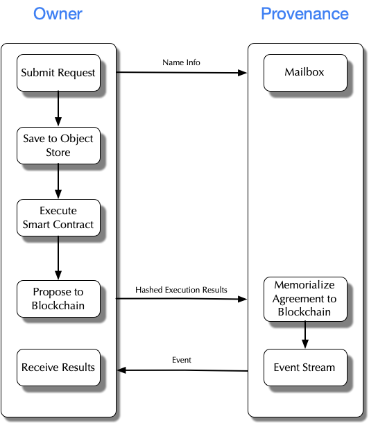

# Explanation

Provenance Blockchain’s Hello World example is designed to demonstrate the process of inputting name information, manipulating the information in a contracts, achieving agreement between multiple participants, memorializing the results to the blockchain, retrieving notifications when the process completes, and retrieving information from the blockchain and encrypted object store.

## Transaction Flow



1. The owner provides the input data to be submitted and uses the SDK to execute the HelloWorld contract.
2. The data is encrypted and saved to the owner’s object store. Other participants would also be identified if the contract required them.
3. The owner executes the HelloWorldContract.
4. The owner sends the hashed execution results of the contracts to Provenance Blockchain where Nodes endorse the transaction.
5. Once the Nodes achieve consensus, a record of the transaction is memorialized \(written\) to the blockchain.
6. The owner listens for events with details about the result of the transaction.

## Data Format

The data format of information exchanged in Provenance Blockchain is defined using Protocol Buffers \(Protobuf\). For the Hello World example, the following Name Protobuf is used:

```kotlin
message ExampleName {
    UUID uuid = 1;
    string first_name = 2 [(index) = { index: ALWAYS}];
    string last_name = 3 [(index) = { index: ALWAYS}];
    string middle_name = 4;
    string prefix = 5;
    string suffix = 6;
    AuditFields audit_fields = 99;
}
```

## Client Contracts

The Hello World contracts \(HelloWorld.kt\) are single party agreements by an owner, as identified by the Participants annotation. The contracts extend the P8eContract class, which is a requirement of all contracts. The contracts must be initiated by an owner, as identified by the Function annotation. The contracts will fail if a different participant attempts to initiate them. The hashed execution results of the contracts will be memorialized to the blockchain with a label defined by the Fact annotation. The contracts are expecting a Name Protobuf to be input in a parameter named “name”, as identified by the Input annotation. The logic of the first contract takes the input pre-populated Name Protobuf, concatenates “-hello” to the first name and “-world” to the last name, and outputs a Name Protobuf with the updated values.

```kotlin
@Participants(roles = [OWNER])
open class HelloWorldContract(): P8eContract() {
    @Function(invokedBy = OWNER)
    @Fact(name = "name")
    open fun name(@Input(name = "name") name: ExampleName ) =
        name.toBuilder()
            .setFirstName(name.firstName.plus("-hello"))
            .setLastName(name.lastName.plus("-world"))
            .build()
}

@Participants(roles = {PartyType.OWNER})
public static class HelloWorldJavaContract extends P8eContract {
    @Function(invokedBy = PartyType.OWNER)
    @Fact(name = "name")
    public ExampleName name(@Input(name = "name") ExampleName name) {
        return name.toBuilder()
                   .setFirstName(name.getFirstName() + "-hello")
                   .setLastName(name.getLastName() + "-world")
                   .build();
    }
}
```

The logic of the second contract takes the name information from the first contract, concatenates “-modified” to the first name and “-updated” to the last name, and outputs a Name Protobuf with the updated values.

```kotlin
@Participants(roles = [OWNER])
open class HelloWorldModifyContract(@Fact(name = "name") val currentName: ExampleName) : P8eContract() {
    @Function(invokedBy = OWNER)
    @Fact(name = "name")
    open fun modifyName(@Input(name = "name") proposedName: ExampleName) =
        proposedName.toBuilder()
                    .setFirstName(currentName.firstName.plus("-modified"))
                    .setLastName(currentName.lastName.plus("-updated"))
                    .build()
}

@Participants(roles = {PartyType.OWNER})
public static class HelloWorldModifyJavaContract extends P8eContract {
    public HelloWorldModifyJavaContract(@Fact(name = "name") ExampleName currentName) {
        this.currentName = currentName;
    }

    private ExampleName currentName;

    @Function(invokedBy = PartyType.OWNER)
    @Fact(name = "name")
    public ExampleName modifyName(@Input(name = "name") ExampleName proposedName) {
        return proposedName.toBuilder()
                           .setFirstName(currentName.getFirstName() + "-modified")
                           .setLastName(currentName.getLastName() + "-updated")
                           .build();
    }
}
```

## Contract Execution

The processes created in the previous section are used to execute the Hello World contracts. Since the owner is initiating the transaction, a ContractManager is created using the owner’s private key.

```kotlin
private val contractManager = ContractManager.create("<private_key_text>".toJavaPrivateKey(), "<api_url>")

ContractManager contractManager = ContractManager.Companion.create(PK.PrivateKey.parseFrom(Hex.decode("<private_key_text>")),"<api_url>");
```

When the HelloWorld class is instantiated, there are watchers created using the ContractManager to listen for messages in the Provenance Blockchain mailbox from the HelloWorldContract. One listens for response messages sent when the contract completes. In this example, when a message is received, the UUID saved to the blockchain is logged. Another listens for errors and logs details about the error.

```kotlin
init {
    contractManager.watchBuilder(HelloWorldContract::class.java).watch()
}

contractManager.watchBuilder(HelloWorldJavaContract).watch();
```

Using the ContractManager, a new contract is created with the HelloWorldContract class. Data is passed to the contract parameter by using the addProposedFact function. Once the parameters have been set, the contract can be executed.

```kotlin
contractManager.newContract(HelloWorldContract::class.java, OWNER).apply {
    addProposedFact("name", ExampleName.newBuilder()
                                       .setFirstName("Hello")
                                       .setLastName("World")
                                       .build())
    contractManager.execute(this)
}

Contract contract = contractManager.newContract(HelloWorldJavaContract.class, PartyType.OWNER);
contract.addProposedFact("name", ExampleName.newBuilder()
                                            .setFirstName("Hello")
                                            .setLastName("World")
                                            .build());
contractManager.execute(contract);
```

## Modify Contract Execution

Similar to the first contract execution, when the HelloWorldModify class is instantiated there are watchers created to listen for messages in the Provenance Blockchain mailbox from the HelloWorldModifyContract. One listens for response messages sent when the contract completes. When a message is received, the UUID of the updated record is logged. Another listens for errors and logs details about the error.

```kotlin
init {
    contractManager.watchBuilder(HelloWorldModifyContract::class.java).watch()
}

contractManager.watchBuilder(HelloWorldModifyJavaContract.class).watch();
```

Using the ContractManager, a new contract is created with the HelloWorldModify contract class. Data is passed to the contract parameter by using the addProposedFact function. Once the parameters have been set, the contract can be executed.

```kotlin
val data = contractManager.hydrate(<UUID>, HelloWorldData::class.java)
contractManager.newContract(HelloWorldModifyContract::class.java, data.scope, OWNER).apply {
    addProposedFact("name", ExampleName.newBuilder()
                                       .setFirstName(data.name.firstName)
                                       .setLastName(data.name.lastName)
                                       .setMiddleName("testing")
                                       .build())
    contractManager.execute(this)
}

HelloWorldJavaData data = contractManager.hydrate(<UUID>, HelloWorldJavaData.class);
Contract contract = contractManager.newContract(HelloWorldModifyJavaContract.class, data.getScope(), PartyType.OWNER);
contract.addProposedFact("name", ExampleName.newBuilder()
                                            .setFirstName(data.getName().getFirstName())
                                            .setLastName(data.getName().getLastName())
                                            .setMiddleName("testing")
                                            .build());
contractManager.execute(contract);
```

## Retrieving Data

Once the data in Hello World example was memorialized to the blockchain, an example was provided to retrieve the information. The information saved to the blockchain was retrieved by scope UUID into a scope object. The same UUID was used to retrieve the actual asset information, in this case name information, from the encrypted object store. These processes are explained in further detail in the Data Retrieval section.

